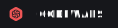

<h1> 🧑‍💻 • About me </h1>

Yo, I'm ***Gun8hoot***. I'm between 15 and 25 years old, and I love music (rap, rock, jazz, and electronic), coding (better wear sunglasses—my code might blind you 👀), video games, and new tech. My goal is to work in cybersecurity, though I'm still exploring different fields—maybe as a SOC analyst, reverse engineer, or penetration tester.

 

***Last things :*** 
🌍 _Peace & Love all over the world_ 🌍

<h1> 💽  • My skills </h1>

    
    
    
    
    
    
    <!--
    To find more badge: 
    https://github.com/Ileriayo/markdown-badges?tab=readme-ov-file#badges
    -->
    

 
<h2> 📊  • Stats </h2>
      
    

<h2>💬 • Social </h2>
    
    
    

<h2>🪙 • If you have money to lose</h2>

| <a href="https://bitcoin.org/en/">BTC</a> | `Zpub6yVrcJ8hxtWXhnJZhjqMacZGNx6mVcBLyCBq7wQyXEU2o1fh9DjQXDak2f4Pu7nwKmBpzhXzhYiAeNTw6yEaxxksVMtbUDwUzxp25rpt8cb` |
|-----------------------------------------------------------------------------------------------------------|-----------------------------|
| <a href="https://www.getmonero.org">XMR</a> | `8AqGdfWV5uRFZyEUKtUpB9Hzys8g2tozDexbPJp9xqLDHaEWpGvKTCZKXQBCYPu8Lb6E3emADjpjCD6FRsBSmdY76vw83DD` |

<!--It's just to fill my readme, dont send me money. If you realy want "waste" your money, send to people in need or to association-->

<h2>📡 • Other Platform </h2>

    <!--I know, Im bad...🫥 -->
    
    <a href="https://tryhackme.com/p/Gun8hoot" rel="TryHackMe"><image src="./src/custom_banner/tryhackme.svg"</a>
    

